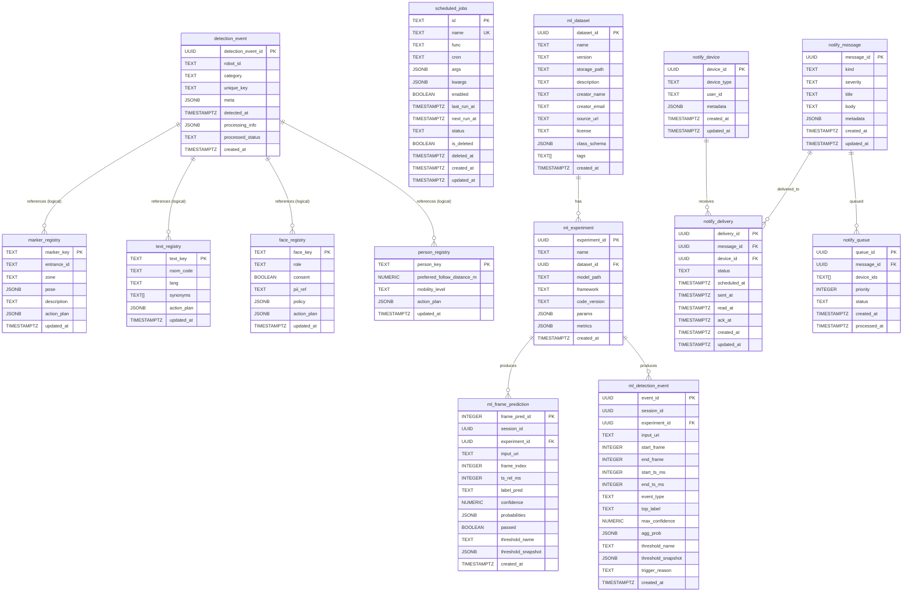
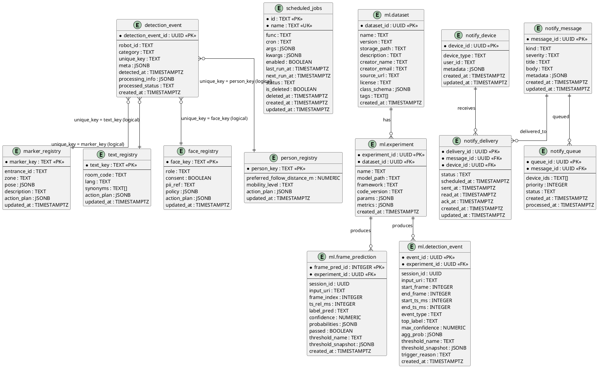

# ER Diagram (Entity Relationship Diagram)

**문서 버전**: 1.0.0  
**최종 업데이트**: 2025-11-10  
**작성자**: Development Team

## 개요

이 문서는 Central Server (App Server)의 데이터베이스 ER Diagram을 제공합니다.  
Interface Specification에 정의된 테이블 간의 관계를 시각화합니다.

---

## ER Diagram (Mermaid 형식)



---

## ER Diagram (PlantUML 형식)



---

## 테이블 관계 설명

### 1. 로봇 인식 이벤트 관계

#### detection_event ↔ 레지스트리 테이블들 (논리적 관계)

- **관계 유형**: 논리적 참조 (외래키 제약조건 없음)
- **연결 방식**: `detection_event.unique_key` = 레지스트리 테이블의 키
- **카디널리티**: 
  - `detection_event` (1) ↔ (0..N) `marker_registry` (category='aruco'일 때)
  - `detection_event` (1) ↔ (0..N) `text_registry` (category='text'일 때)
  - `detection_event` (1) ↔ (0..N) `face_registry` (category='face'일 때)
  - `detection_event` (1) ↔ (0..N) `person_registry` (category='person'일 때)

**예시 쿼리**:
```sql
-- ArUco 마커 이벤트와 레지스트리 조인
SELECT de.*, mr.entrance_id, mr.zone
FROM detection_event de
LEFT JOIN marker_registry mr ON de.unique_key = mr.marker_key
WHERE de.category = 'aruco';
```

### 2. ML 레지스트리 관계

#### ml.dataset ↔ ml.experiment (외래키 관계)

- **관계 유형**: 일대다 (One-to-Many)
- **외래키**: `ml.experiment.dataset_id` → `ml.dataset.dataset_id`
- **카디널리티**: `ml.dataset` (1) ↔ (0..N) `ml.experiment`
- **제약조건**: `ON DELETE RESTRICT`

#### ml.experiment ↔ ml.frame_prediction (외래키 관계)

- **관계 유형**: 일대다 (One-to-Many)
- **외래키**: `ml.frame_prediction.experiment_id` → `ml.experiment.experiment_id`
- **카디널리티**: `ml.experiment` (1) ↔ (0..N) `ml.frame_prediction`

#### ml.experiment ↔ ml.detection_event (외래키 관계)

- **관계 유형**: 일대다 (One-to-Many)
- **외래키**: `ml.detection_event.experiment_id` → `ml.experiment.experiment_id`
- **카디널리티**: `ml.experiment` (1) ↔ (0..N) `ml.detection_event`

### 3. 알림 시스템 관계

#### notify_message ↔ notify_delivery (외래키 관계)

- **관계 유형**: 일대다 (One-to-Many)
- **외래키**: `notify_delivery.message_id` → `notify_message.message_id`
- **카디널리티**: `notify_message` (1) ↔ (0..N) `notify_delivery`

#### notify_device ↔ notify_delivery (외래키 관계)

- **관계 유형**: 일대다 (One-to-Many)
- **외래키**: `notify_delivery.device_id` → `notify_device.device_id`
- **카디널리티**: `notify_device` (1) ↔ (0..N) `notify_delivery`

#### notify_message ↔ notify_queue (외래키 관계)

- **관계 유형**: 일대다 (One-to-Many)
- **외래키**: `notify_queue.message_id` → `notify_message.message_id`
- **카디널리티**: `notify_message` (1) ↔ (0..N) `notify_queue`

### 4. 독립 테이블

#### scheduled_jobs

- **관계**: 다른 테이블과의 외래키 관계 없음
- **설명**: 스케줄 작업 관리용 독립 테이블

---

## 테이블 그룹별 분류

### 로봇 인식 시스템 (Robot Detection System)

```
detection_event (공통 이벤트 로그)
    │
    ├── marker_registry (ArUco 마커 레지스트리)
    │   └── unique_key → marker_key (논리적)
    │
    ├── text_registry (OCR 텍스트 레지스트리)
    │   └── unique_key → text_key (논리적)
    │
    ├── face_registry (얼굴 레지스트리)
    │   └── unique_key → face_key (논리적)
    │
    └── person_registry (전신 레지스트리)
        └── unique_key → person_key (논리적)
```

### ML 레지스트리 시스템 (ML Registry System)

```
ml.dataset
    │
    └── ml.experiment (dataset_id FK)
            │
            ├── ml.frame_prediction (experiment_id FK)
            │
            └── ml.detection_event (experiment_id FK)
```

### 알림 시스템 (Notification System)

```
notify_message
    │
    ├── notify_delivery (message_id FK)
    │   └── notify_device (device_id FK)
    │
    └── notify_queue (message_id FK)
```

### 스케줄러 시스템 (Scheduler System)

```
scheduled_jobs (독립 테이블)
```

---

## 주요 제약조건

### Primary Key (PK)

- 모든 테이블은 기본키를 가집니다.
- UUID 타입: `detection_event_id`, `dataset_id`, `experiment_id`, `message_id`, `device_id`, `delivery_id`, `queue_id`, `event_id`
- TEXT 타입: `marker_key`, `text_key`, `face_key`, `person_key`, `id` (scheduled_jobs)
- INTEGER 타입: `frame_pred_id`

### Foreign Key (FK)

- **ml.experiment.dataset_id** → `ml.dataset.dataset_id` (ON DELETE RESTRICT)
- **ml.frame_prediction.experiment_id** → `ml.experiment.experiment_id`
- **ml.detection_event.experiment_id** → `ml.experiment.experiment_id`
- **notify_delivery.message_id** → `notify_message.message_id`
- **notify_delivery.device_id** → `notify_device.device_id`
- **notify_queue.message_id** → `notify_message.message_id`

### Unique Constraint (UK)

- `scheduled_jobs.name`: 작업 이름은 고유해야 함
- `ml.dataset(name, version)`: 데이터셋 이름과 버전 조합은 고유해야 함

### Check Constraint

- `face_registry.role`: 'elder', 'caregiver', 'visitor' 중 하나만 허용

---

## 인덱스 전략

### detection_event

- `idx_detection_event_time`: `detected_at DESC` (시간 기반 조회)
- `idx_detection_event_cat_key`: `(category, unique_key)` (카테고리별 조회)
- `idx_detection_event_robot`: `robot_id` (로봇별 조회)
- `idx_detection_event_status`: `processed_status` (상태별 조회)

### scheduled_jobs

- `ix_scheduled_jobs_name`: `name` (UNIQUE)
- `ix_scheduled_jobs_enabled`: `enabled`
- `ix_scheduled_jobs_status`: `status`
- `ix_scheduled_jobs_is_deleted`: `is_deleted`
- `ix_scheduled_jobs_next_run`: `next_run_at`

---

## DataGrip에서 ER Diagram 생성 방법

### 사전 준비

1. **DataGrip 설치**
   - JetBrains 공식 사이트에서 DataGrip 다운로드 및 설치
   - 평가판 30일 또는 라이선스 구매

2. **데이터베이스 연결 설정**
   - DataGrip 실행 후 **"+"** 버튼 클릭 → **"Data Source"** → **"PostgreSQL"** 선택
   - 연결 정보 입력:
     - **Host**: `localhost` (또는 실제 호스트)
     - **Port**: `15432` (또는 실제 포트)
     - **Database**: `iot_care`
     - **User**: `svc_dev`
     - **Password**: `IOT_dev_123!@#`
   - **"Test Connection"** 클릭하여 연결 확인
   - **"OK"** 클릭하여 저장

### 방법 1: 전체 데이터베이스 ER Diagram 생성

1. **Database 탭에서 데이터베이스 선택**
   - 좌측 **"Database"** 탭에서 연결한 데이터베이스(`iot_care`)를 찾습니다.

2. **ER Diagram 생성**
   - 데이터베이스 이름을 **우클릭**
   - **"Diagrams"** → **"Show Diagram"** 선택
   - 또는 데이터베이스 이름을 선택한 후 상단 툴바의 **"Diagrams"** 아이콘 클릭

3. **Diagram 창 확인**
   - 새 창이 열리며 모든 테이블과 관계가 자동으로 표시됩니다.
   - 외래키 관계는 자동으로 선으로 연결됩니다.

### 방법 2: 특정 스키마만 선택

1. **스키마 선택**
   - Database 탭에서 **"Schemas"** → **"public"** 또는 **"ml"** 또는 **"notify"** 선택
   - 스키마 이름을 **우클릭**
   - **"Diagrams"** → **"Show Diagram"** 선택

2. **결과 확인**
   - 선택한 스키마의 테이블만 표시됩니다.

### 방법 3: 특정 테이블 그룹 선택

1. **테이블 선택**
   - Database 탭에서 원하는 테이블들을 선택합니다.
   - **Ctrl** (Windows/Linux) 또는 **Cmd** (Mac) 키를 누른 채로 여러 테이블 클릭

2. **ER Diagram 생성**
   - 선택한 테이블 중 하나를 **우클릭**
   - **"Diagrams"** → **"Show Diagram"** 선택

3. **관계 확인**
   - 선택한 테이블과 관련된 테이블도 자동으로 포함될 수 있습니다.

### 방법 4: Diagram 커스터마이징

#### 레이아웃 조정

1. **자동 레이아웃**
   - Diagram 창 상단 툴바에서 **"Layout"** → **"Auto Layout"** 선택
   - 또는 **"Ctrl+L"** (Windows/Linux) / **"Cmd+L"** (Mac)

2. **수동 배치**
   - 테이블을 드래그하여 원하는 위치로 이동
   - 관계 선은 자동으로 따라갑니다.

#### 표시 옵션 설정

1. **View 메뉴 사용**
   - Diagram 창 상단 **"View"** 메뉴에서 다음 옵션 선택/해제:
     - **"Show Foreign Keys"**: 외래키 관계 표시 (기본: 활성화)
     - **"Show Indexes"**: 인덱스 표시
     - **"Show Comments"**: 컬럼 주석 표시
     - **"Show Data Types"**: 데이터 타입 표시 (기본: 활성화)
     - **"Show Nullability"**: NULL 허용 여부 표시

2. **색상 스키마 변경**
   - **"View"** → **"Color Scheme"** → 원하는 스키마 선택
   - 또는 테이블별로 색상 지정 가능

#### 테이블 추가/제거

1. **테이블 추가**
   - Database 탭에서 테이블을 드래그하여 Diagram 창으로 이동
   - 또는 Diagram 창에서 **"+"** 버튼 클릭 → 테이블 선택

2. **테이블 제거**
   - Diagram 창에서 테이블을 선택하고 **Delete** 키 누르기
   - 또는 테이블을 **우클릭** → **"Remove from Diagram"**

### 방법 5: ER Diagram 내보내기

#### 이미지로 내보내기

1. **내보내기 메뉴**
   - Diagram 창에서 **우클릭** → **"Export Diagram"** → **"Export to File"**
   - 또는 **"File"** → **"Export Diagram"** → **"Export to File"**

2. **파일 형식 선택**
   - **PNG**: 고해상도 이미지 (권장)
   - **SVG**: 벡터 이미지 (확대 시 품질 유지)
   - **PDF**: 문서 삽입용
   - **JPEG**: 압축 이미지

3. **설정 조정**
   - 해상도 설정 (DPI)
   - 배경색 설정
   - 테두리 설정

#### 인쇄

1. **인쇄 메뉴**
   - **"File"** → **"Print"** 또는 **"Ctrl+P"** (Windows/Linux) / **"Cmd+P"** (Mac)

2. **인쇄 설정**
   - 용지 크기 선택
   - 방향 선택 (가로/세로)
   - 배율 조정

### 방법 6: ER Diagram 저장 및 재사용

1. **Diagram 저장**
   - Diagram 창에서 **"File"** → **"Save"** 또는 **"Ctrl+S"** / **"Cmd+S"**
   - `.diagram` 파일로 저장됩니다.

2. **Diagram 열기**
   - **"File"** → **"Open"** → 저장한 `.diagram` 파일 선택
   - 또는 Project 탭에서 `.diagram` 파일 더블클릭

### 방법 7: SQL 스크립트로 관계 확인 (대안)

DataGrip이 없는 경우, PostgreSQL 쿼리로 관계를 확인할 수 있습니다:

```sql
-- 외래키 관계 조회
SELECT
    tc.table_schema,
    tc.table_name,
    kcu.column_name,
    ccu.table_schema AS foreign_table_schema,
    ccu.table_name AS foreign_table_name,
    ccu.column_name AS foreign_column_name
FROM information_schema.table_constraints AS tc
JOIN information_schema.key_column_usage AS kcu
    ON tc.constraint_name = kcu.constraint_name
    AND tc.table_schema = kcu.table_schema
JOIN information_schema.constraint_column_usage AS ccu
    ON ccu.constraint_name = tc.constraint_name
    AND ccu.table_schema = tc.table_schema
WHERE tc.constraint_type = 'FOREIGN KEY'
    AND tc.table_schema IN ('public', 'ml', 'notify')
ORDER BY tc.table_schema, tc.table_name;
```

### 팁 및 트러블슈팅

1. **관계가 표시되지 않는 경우**
   - 외래키 제약조건이 데이터베이스에 정의되어 있는지 확인
   - 논리적 관계는 수동으로 주석 추가 필요

2. **테이블이 너무 많은 경우**
   - 특정 스키마나 테이블 그룹만 선택하여 Diagram 생성
   - 필터 기능 사용

3. **성능 문제**
   - 큰 데이터베이스의 경우 전체 Diagram 생성 시 시간이 걸릴 수 있음
   - 필요한 테이블만 선택하여 생성 권장

4. **다이어그램이 깨지는 경우**
   - **"Layout"** → **"Auto Layout"** 재실행
   - 테이블 위치 수동 조정

### 방법 5: SQL 스크립트로 ER Diagram 생성 (대안)

DataGrip이 없는 경우, PostgreSQL의 `pg_catalog`를 사용하여 관계를 추출할 수 있습니다:

```sql
-- 외래키 관계 조회
SELECT
    tc.table_schema,
    tc.table_name,
    kcu.column_name,
    ccu.table_schema AS foreign_table_schema,
    ccu.table_name AS foreign_table_name,
    ccu.column_name AS foreign_column_name
FROM information_schema.table_constraints AS tc
JOIN information_schema.key_column_usage AS kcu
    ON tc.constraint_name = kcu.constraint_name
    AND tc.table_schema = kcu.table_schema
JOIN information_schema.constraint_column_usage AS ccu
    ON ccu.constraint_name = tc.constraint_name
    AND ccu.table_schema = tc.table_schema
WHERE tc.constraint_type = 'FOREIGN KEY'
ORDER BY tc.table_schema, tc.table_name;
```

---

## ER Diagram 도구 추천

### 1. DataGrip (JetBrains)
- **장점**: IDE 통합, 자동 관계 감지, 실시간 동기화
- **단점**: 유료 (무료 평가판 30일)

### 2. DBeaver (무료)
- **장점**: 무료, 오픈소스, 다양한 데이터베이스 지원
- **단점**: UI가 다소 복잡할 수 있음

### 3. pgAdmin (PostgreSQL 전용)
- **장점**: PostgreSQL 전용, 무료, 공식 도구
- **단점**: PostgreSQL만 지원

### 4. dbdiagram.io (온라인)
- **장점**: 무료, 웹 기반, 공유 용이
- **단점**: 인터넷 연결 필요

### 5. PlantUML / Mermaid (코드 기반)
- **장점**: 버전 관리 가능, 문서화 용이
- **단점**: 수동 작성 필요

---

## ER Diagram 업데이트 가이드

### 마이그레이션 후 업데이트

1. **새 테이블 추가 시**
   - ER Diagram에 새 테이블 추가
   - 관계 선 추가 (외래키 또는 논리적 관계)

2. **컬럼 변경 시**
   - ER Diagram의 테이블 정의 업데이트
   - 관계에 영향을 주는 경우 관계 재검토

3. **외래키 추가/삭제 시**
   - ER Diagram의 관계 선 추가/삭제
   - 관계 설명 업데이트

---

## 관련 문서

- [Interface Specification](../interfaces/INTERFACE_SPECIFICATION.md)
- [로봇 인식 스키마](./robot_detection_schema.md)
- [마이그레이션 가이드](../MIGRATION_GUIDE.md)

---

## 변경 이력

| 버전 | 날짜 | 변경 내용 | 작성자 |
|------|------|----------|--------|
| 1.0.0 | 2025-11-10 | 초기 버전 작성 | Development Team |

