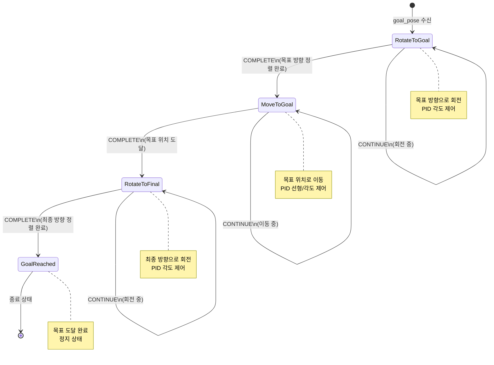
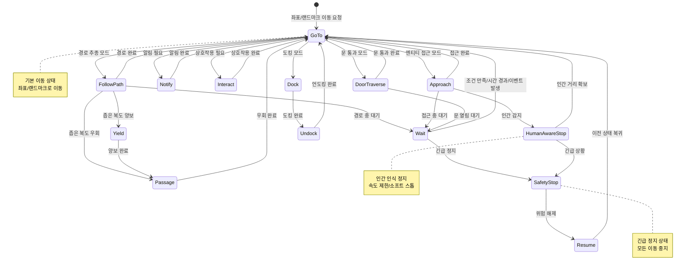

# Pinky State Machine State Diagram

**작성일**: 2025-11-10  
**패키지**: `pinky_state_machine`  
**기반 코드**: `move_pinky_state_machine.py`

## 개요

이 문서는 Pinky 로봇의 State Machine 기반 제어 시스템의 State Diagram을 제공합니다.  
실제 구현된 코드를 기반으로 작성되었으며, 확장 예정인 기능들도 포함합니다.

---

## State Diagram (Mermaid 형식)

```mermaid
classDiagram
    class PinkyGoalController {
        - angle_tolerance: float
        - distance_tolerance: float
        - angular_pid: PID
        - linear_pid: PID
        - state_instance: ControllerState
        - goal_pose: SimplePose
        - state_transition_manager: StateTransitionManager
        + __init__()
        + parameter_callback(params) : SetParametersResult
        + goal_pose_callback(msg)
        + odom_callback(msg)
    }

    class ControllerState {
        <<abstract>>
        - controller: PinkyGoalController
        + __init__(controller)
        + update(current_pose) : (Twist, StateResult)
    }

    class RotateToGoalState {
        + update(current_pose) : (Twist, StateResult)
    }

    class MoveToGoalState {
        + update(current_pose) : (Twist, StateResult)
    }

    class RotateToFinalState {
        + update(current_pose) : (Twist, StateResult)
    }

    class GoalReachedState {
        + update(current_pose) : (Twist, StateResult)
    }

    class StateTransitionManager {
        - controller: PinkyGoalController
        + __init__(controller)
        + get_next_state(current_state, state_result) : ControllerState
    }

    class StateResult {
        <<enumeration>>
        + CONTINUE = 0
        + COMPLETE = 1
    }

    class PID {
        - P: float
        - I: float
        - D: float
        - max_state: float
        - min_state: float
        - pre_state: float
        - dt: float
        - integrated_state: float
        - pre_time: float
        + __init__()
        + update(state) : float
    }

    %% 확장 예정 상태들
    class GoToState {
        <<planned>>
        - goal: Pose
        - path: Path
        + update(current_pose) : (Twist, StateResult)
    }

    class FollowPathState {
        <<planned>>
        - path: Path
        - current_waypoint_index: int
        + update(current_pose) : (Twist, StateResult)
    }

    class ApproachState {
        <<planned>>
        - entity: Entity
        - offset: float
        + update(current_pose) : (Twist, StateResult)
    }

    class WaitState {
        <<planned>>
        - condition: Condition
        - timeout: float
        - event: Event
        + update(current_pose) : (Twist, StateResult)
    }

    class YieldState {
        <<planned>>
        - passage_width: float
        - other_robot_pose: Pose
        + update(current_pose) : (Twist, StateResult)
    }

    class PassageState {
        <<planned>>
        - passage_width: float
        - other_robot_pose: Pose
        + update(current_pose) : (Twist, StateResult)
    }

    class DoorTraverseState {
        <<planned>>
        - door_id: string
        - door_status: string
        + update(current_pose) : (Twist, StateResult)
    }

    class DockState {
        <<planned>>
        - docking_station_id: string
        - alignment_tolerance: float
        + update(current_pose) : (Twist, StateResult)
    }

    class UndockState {
        <<planned>>
        - exit_path: Path
        + update(current_pose) : (Twist, StateResult)
    }

    class SafetyStopState {
        <<planned>>
        - stop_reason: string
        - resume_condition: Condition
        + update(current_pose) : (Twist, StateResult)
    }

    class ResumeState {
        <<planned>>
        - previous_state: ControllerState
        + update(current_pose) : (Twist, StateResult)
    }

    class HumanAwareStopState {
        <<planned>>
        - human_distance: float
        - speed_limit: float
        + update(current_pose) : (Twist, StateResult)
    }

    class NotifyState {
        <<planned>>
        - notification_type: string
        - message: string
        + update(current_pose) : (Twist, StateResult)
    }

    class InteractState {
        <<planned>>
        - interaction_type: string
        - target: Entity
        + update(current_pose) : (Twist, StateResult)
    }

    %% 관계 정의
    PinkyGoalController --> PID : uses
    PinkyGoalController --> ControllerState : manages
    PinkyGoalController --> StateTransitionManager : uses

    ControllerState <|-- RotateToGoalState
    ControllerState <|-- MoveToGoalState
    ControllerState <|-- RotateToFinalState
    ControllerState <|-- GoalReachedState

    %% 확장 예정 상태들 (ControllerState 상속)
    ControllerState <|-- GoToState
    ControllerState <|-- FollowPathState
    ControllerState <|-- ApproachState
    ControllerState <|-- WaitState
    ControllerState <|-- YieldState
    ControllerState <|-- PassageState
    ControllerState <|-- DoorTraverseState
    ControllerState <|-- DockState
    ControllerState <|-- UndockState
    ControllerState <|-- SafetyStopState
    ControllerState <|-- ResumeState
    ControllerState <|-- HumanAwareStopState
    ControllerState <|-- NotifyState
    ControllerState <|-- InteractState

    StateTransitionManager --> ControllerState : manages
    ControllerState --> StateResult : returns
```



---

## State Diagram (PlantUML 형식)

```plantuml
@startuml Pinky_State_Machine
!define IMPLEMENTED_COLOR #E6F3FF
!define PLANNED_COLOR #FFF4E6

skinparam linetype ortho
skinparam class {
    BackgroundColor<<implemented>> IMPLEMENTED_COLOR
    BackgroundColor<<planned>> PLANNED_COLOR
}

' 메인 컨트롤러
class PinkyGoalController <<Node>> {
    - angle_tolerance: float
    - distance_tolerance: float
    - angular_pid: PID
    - linear_pid: PID
    - state_instance: ControllerState
    - goal_pose: SimplePose
    - state_transition_manager: StateTransitionManager
    --
    + __init__()
    + parameter_callback(params): SetParametersResult
    + goal_pose_callback(msg)
    + odom_callback(msg)
}

' 추상 상태 클래스
abstract class ControllerState {
    - controller: PinkyGoalController
    --
    + __init__(controller)
    + {abstract} update(current_pose): (Twist, StateResult)
}

' 구현된 상태들
class RotateToGoalState <<implemented>> {
    + update(current_pose): (Twist, StateResult)
}

class MoveToGoalState <<implemented>> {
    + update(current_pose): (Twist, StateResult)
}

class RotateToFinalState <<implemented>> {
    + update(current_pose): (Twist, StateResult)
}

class GoalReachedState <<implemented>> {
    + update(current_pose): (Twist, StateResult)
}

' 상태 전이 관리자
class StateTransitionManager {
    - controller: PinkyGoalController
    --
    + __init__(controller)
    + get_next_state(current_state, state_result): ControllerState
}

' 상태 결과 열거형
enum StateResult {
    CONTINUE = 0
    COMPLETE = 1
}

' PID 제어기
class PID {
    - P: float
    - I: float
    - D: float
    - max_state: float
    - min_state: float
    - pre_state: float
    - dt: float
    - integrated_state: float
    - pre_time: float
    --
    + __init__()
    + update(state): float
}

' 확장 예정 상태들
class GoToState <<planned>> {
    - goal: Pose
    - path: Path
    + update(current_pose): (Twist, StateResult)
}

class FollowPathState <<planned>> {
    - path: Path
    - current_waypoint_index: int
    + update(current_pose): (Twist, StateResult)
}

class ApproachState <<planned>> {
    - entity: Entity
    - offset: float
    + update(current_pose): (Twist, StateResult)
}

class WaitState <<planned>> {
    - condition: Condition
    - timeout: float
    - event: Event
    + update(current_pose): (Twist, StateResult)
}

class YieldState <<planned>> {
    - passage_width: float
    - other_robot_pose: Pose
    + update(current_pose): (Twist, StateResult)
}

class PassageState <<planned>> {
    - passage_width: float
    - other_robot_pose: Pose
    + update(current_pose): (Twist, StateResult)
}

class DoorTraverseState <<planned>> {
    - door_id: string
    - door_status: string
    + update(current_pose): (Twist, StateResult)
}

class DockState <<planned>> {
    - docking_station_id: string
    - alignment_tolerance: float
    + update(current_pose): (Twist, StateResult)
}

class UndockState <<planned>> {
    - exit_path: Path
    + update(current_pose): (Twist, StateResult)
}

class SafetyStopState <<planned>> {
    - stop_reason: string
    - resume_condition: Condition
    + update(current_pose): (Twist, StateResult)
}

class ResumeState <<planned>> {
    - previous_state: ControllerState
    + update(current_pose): (Twist, StateResult)
}

class HumanAwareStopState <<planned>> {
    - human_distance: float
    - speed_limit: float
    + update(current_pose): (Twist, StateResult)
}

class NotifyState <<planned>> {
    - notification_type: string
    - message: string
    + update(current_pose): (Twist, StateResult)
}

class InteractState <<planned>> {
    - interaction_type: string
    - target: Entity
    + update(current_pose): (Twist, StateResult)
}

' 관계 정의
PinkyGoalController --> PID : uses
PinkyGoalController --> ControllerState : manages
PinkyGoalController --> StateTransitionManager : uses

ControllerState <|-- RotateToGoalState
ControllerState <|-- MoveToGoalState
ControllerState <|-- RotateToFinalState
ControllerState <|-- GoalReachedState

' 확장 예정 상태들
ControllerState <|-- GoToState
ControllerState <|-- FollowPathState
ControllerState <|-- ApproachState
ControllerState <|-- WaitState
ControllerState <|-- YieldState
ControllerState <|-- PassageState
ControllerState <|-- DoorTraverseState
ControllerState <|-- DockState
ControllerState <|-- UndockState
ControllerState <|-- SafetyStopState
ControllerState <|-- ResumeState
ControllerState <|-- HumanAwareStopState
ControllerState <|-- NotifyState
ControllerState <|-- InteractState

StateTransitionManager --> ControllerState : manages
ControllerState --> StateResult : returns

@enduml
```



---

## 상태 전이 다이어그램



---

## 확장 예정 상태 전이 다이어그램



---

## 클래스 상세 설명

### PinkyGoalController

**역할**: 메인 컨트롤러 노드 (ROS2 Node 상속)

**주요 속성**:
- `angle_tolerance`: 각도 허용 오차
- `distance_tolerance`: 거리 허용 오차
- `angular_pid`: 각도 제어용 PID 제어기
- `linear_pid`: 선형 제어용 PID 제어기
- `state_instance`: 현재 상태 인스턴스
- `goal_pose`: 목표 위치 및 자세
- `state_transition_manager`: 상태 전이 관리자

**주요 메서드**:
- `__init__()`: 초기화 및 파라미터 선언
- `parameter_callback()`: 런타임 파라미터 변경 처리
- `goal_pose_callback()`: 목표 위치 수신 및 상태 초기화
- `odom_callback()`: 현재 위치 수신 및 상태 업데이트

**토픽**:
- 구독: `odom` (nav_msgs/Odometry), `goal_pose` (geometry_msgs/Pose)
- 발행: `cmd_vel` (geometry_msgs/Twist), `angle_error`, `distance_error`, `state`

### ControllerState (추상 클래스)

**역할**: 모든 상태의 기본 클래스

**주요 메서드**:
- `__init__(controller)`: 컨트롤러 참조 저장
- `update(current_pose)`: 상태 업데이트 및 제어 명령 반환 (추상 메서드)

### 구현된 상태들

#### RotateToGoalState
- **목적**: 목표 방향으로 회전
- **제어**: PID 각도 제어
- **완료 조건**: 각도 오차가 `angle_tolerance` 이하
- **다음 상태**: `MoveToGoalState` (COMPLETE 시)

#### MoveToGoalState
- **목적**: 목표 위치로 이동 (동시에 방향 보정)
- **제어**: PID 선형 및 각도 제어
- **완료 조건**: 거리 오차가 `distance_tolerance` 이하
- **다음 상태**: `RotateToFinalState` (COMPLETE 시)

#### RotateToFinalState
- **목적**: 최종 방향으로 회전
- **제어**: PID 각도 제어
- **완료 조건**: 각도 오차가 `angle_tolerance` 이하
- **다음 상태**: `GoalReachedState` (COMPLETE 시)

#### GoalReachedState
- **목적**: 목표 도달 완료 (종료 상태)
- **제어**: 정지 (linear=0, angular=0)
- **완료 조건**: 항상 COMPLETE
- **다음 상태**: 자기 자신 (터미널 상태)

### StateTransitionManager

**역할**: 상태 전이 규칙 관리

**주요 메서드**:
- `get_next_state(current_state, state_result)`: 현재 상태와 결과에 따라 다음 상태 반환

**전이 규칙**:
- `RotateToGoalState` + COMPLETE → `MoveToGoalState`
- `MoveToGoalState` + COMPLETE → `RotateToFinalState`
- `RotateToFinalState` + COMPLETE → `GoalReachedState`
- `GoalReachedState` + COMPLETE → `GoalReachedState` (유지)
- 모든 상태 + CONTINUE → 현재 상태 유지

### StateResult (열거형)

- `CONTINUE = 0`: 상태 계속 실행
- `COMPLETE = 1`: 상태 완료, 다음 상태로 전이

### PID

**역할**: PID 제어기

**주요 속성**:
- `P`, `I`, `D`: PID 게인
- `max_state`, `min_state`: 출력 제한
- `pre_state`, `dt`, `integrated_state`, `pre_time`: 내부 상태

**주요 메서드**:
- `update(state)`: PID 제어 출력 계산

---

## 확장 예정 상태 상세 설명

### GoToState
- **목적**: 좌표/랜드마크로 이동
- **특징**: 기본 이동 상태, 다른 상태들의 기반이 됨
- **입력**: `goal` (Pose), `path` (Path, 선택사항)

### FollowPathState
- **목적**: 미리 생성된 경로 추종
- **특징**: 경로상의 웨이포인트를 순차적으로 추종
- **입력**: `path` (Path), `current_waypoint_index` (int)

### ApproachState
- **목적**: 사람/문/도킹스테이션 앞 "거리 유지 접근"
- **특징**: 엔티티로부터 지정된 거리를 유지하며 접근
- **입력**: `entity` (Entity), `offset` (float)

### WaitState
- **목적**: 조건/시간/센서 이벤트 대기
- **특징**: 이동 중지, 조건 만족 시 재개
- **입력**: `condition` (Condition), `timeout` (float), `event` (Event)

### YieldState / PassageState
- **목적**: 복도 교행 (폭 좁을 때 양보/우회)
- **특징**: 다른 로봇과의 협조적 이동
- **입력**: `passage_width` (float), `other_robot_pose` (Pose)

### DoorTraverseState
- **목적**: 문 인식→열림 감지→통과 (필요 시 대기/요청)
- **특징**: 문 상태 모니터링 및 통과 제어
- **입력**: `door_id` (string), `door_status` (string)

### DockState / UndockState
- **목적**: 도킹 스테이션 정밀 접근/정렬/충전
- **특징**: 정밀 위치 제어 및 정렬
- **입력**: `docking_station_id` (string), `alignment_tolerance` (float)

### SafetyStopState / ResumeState
- **목적**: 긴급 정지, 위험 해제 후 재개
- **특징**: 모든 이동 중지, 이전 상태 복귀
- **입력**: `stop_reason` (string), `resume_condition` (Condition), `previous_state` (ControllerState)

### HumanAwareStopState
- **목적**: 인간 가까이 속도 제한/소프트 스톱
- **특징**: 인간 감지 시 안전 거리 유지
- **입력**: `human_distance` (float), `speed_limit` (float)

### NotifyState / InteractState
- **목적**: 벨/LED/음성/패널 표시 (태스크 레벨과 느슨히 결합)
- **특징**: 로봇과의 상호작용 제공
- **입력**: `notification_type` (string), `message` (string), `interaction_type` (string), `target` (Entity)

---

## 상태 전이 흐름

### 기본 흐름 (현재 구현)

```
[시작]
  ↓
goal_pose 수신
  ↓
RotateToGoal (목표 방향 회전)
  ↓ (COMPLETE)
MoveToGoal (목표 위치 이동)
  ↓ (COMPLETE)
RotateToFinal (최종 방향 회전)
  ↓ (COMPLETE)
GoalReached (목표 도달)
  ↓
[종료]
```

### 확장 예정 흐름

```
GoTo (기본 이동)
  ├─→ FollowPath (경로 추종)
  │     ├─→ Wait (대기)
  │     ├─→ Yield (양보)
  │     └─→ Passage (우회)
  ├─→ Approach (접근)
  │     ├─→ Wait (대기)
  │     └─→ HumanAwareStop (인간 인식 정지)
  ├─→ DoorTraverse (문 통과)
  │     └─→ Wait (문 열림 대기)
  ├─→ Dock (도킹)
  │     └─→ Undock (언도킹)
  ├─→ Wait (대기)
  │     └─→ SafetyStop (긴급 정지)
  ├─→ SafetyStop (긴급 정지)
  │     └─→ Resume (재개)
  ├─→ HumanAwareStop (인간 인식 정지)
  │     └─→ SafetyStop (긴급 정지)
  ├─→ Notify (알림)
  └─→ Interact (상호작용)
```

---

## 코드 위치

### 구현된 파일
- **메인 컨트롤러**: `pinky_state_machine/move_pinky_state_machine.py`
- **PID 제어기**: `pinky_state_machine/control_apps.py`
- **GUI 모니터링**: `pinky_state_machine/qmonitor_pinky_state_machine.py`

### 주요 클래스 위치
- `PinkyGoalController`: `move_pinky_state_machine.py:193`
- `ControllerState`: `move_pinky_state_machine.py:70`
- `RotateToGoalState`: `move_pinky_state_machine.py:79`
- `MoveToGoalState`: `move_pinky_state_machine.py:106`
- `RotateToFinalState`: `move_pinky_state_machine.py:137`
- `GoalReachedState`: `move_pinky_state_machine.py:161`
- `StateTransitionManager`: `move_pinky_state_machine.py:172`
- `StateResult`: `move_pinky_state_machine.py:64`
- `PID`: `control_apps.py:3`

---

## 관련 문서

- [README.md](../README.md) - 패키지 개요 및 사용 가이드
- [DEVELOPMENT_REPORT.md](./DEVELOPMENT_REPORT.md) - 개발 현황 리포트
- [TODO.md](./TODO.md) - 개발 할 일 목록

---

## 변경 이력

| 버전 | 날짜 | 변경 내용 | 작성자 |
|------|------|----------|--------|
| 1.0.0 | 2025-11-10 | 초기 버전 작성 (구현된 상태 + 확장 예정 상태) | Development Team |

